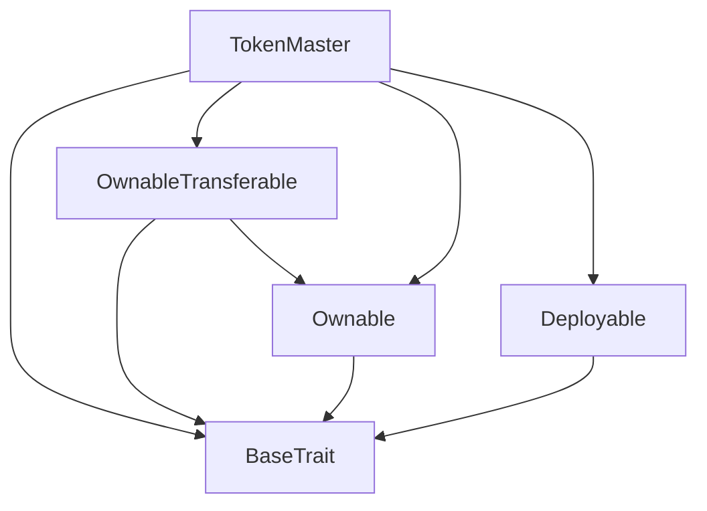
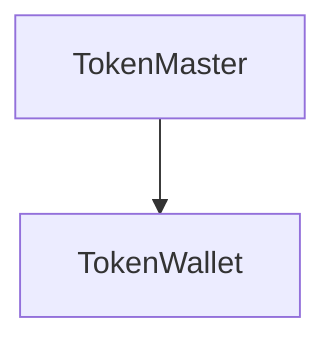

# TACT Compilation Report
Contract: TokenMaster
BOC Size: 2211 bytes

# Types
Total Types: 38

## StateInit
TLB: `_ code:^cell data:^cell = StateInit`
Signature: `StateInit{code:^cell,data:^cell}`

## Context
TLB: `_ bounced:bool sender:address value:int257 raw:^slice = Context`
Signature: `Context{bounced:bool,sender:address,value:int257,raw:^slice}`

## SendParameters
TLB: `_ bounce:bool to:address value:int257 mode:int257 body:Maybe ^cell code:Maybe ^cell data:Maybe ^cell = SendParameters`
Signature: `SendParameters{bounce:bool,to:address,value:int257,mode:int257,body:Maybe ^cell,code:Maybe ^cell,data:Maybe ^cell}`

## WalletData
TLB: `_ balance:int257 owner:address master:address code:^cell = WalletData`
Signature: `WalletData{balance:int257,owner:address,master:address,code:^cell}`

## ChangeOwner
TLB: `change_owner#819dbe99 queryId:uint64 newOwner:address = ChangeOwner`
Signature: `ChangeOwner{queryId:uint64,newOwner:address}`

## ChangeOwnerOk
TLB: `change_owner_ok#327b2b4a queryId:uint64 newOwner:address = ChangeOwnerOk`
Signature: `ChangeOwnerOk{queryId:uint64,newOwner:address}`

## Deploy
TLB: `deploy#946a98b6 queryId:uint64 = Deploy`
Signature: `Deploy{queryId:uint64}`

## DeployOk
TLB: `deploy_ok#aff90f57 queryId:uint64 = DeployOk`
Signature: `DeployOk{queryId:uint64}`

## FactoryDeploy
TLB: `factory_deploy#6d0ff13b queryId:uint64 cashback:address = FactoryDeploy`
Signature: `FactoryDeploy{queryId:uint64,cashback:address}`

## Transfer
TLB: `transfer#0f817ea5 query_id:uint64 amount:coins destination:address response_destination:address custom_payload:Maybe ^cell forward_ton_amount:coins = Transfer`
Signature: `Transfer{query_id:uint64,amount:coins,destination:address,response_destination:address,custom_payload:Maybe ^cell,forward_ton_amount:coins}`

## InternalTransfer
TLB: `internal_transfer#178d4519 query_id:uint64 amount:coins from:address response_destination:address forward_ton_amount:coins forward_payload:remainder<slice> = InternalTransfer`
Signature: `InternalTransfer{query_id:uint64,amount:coins,from:address,response_destination:address,forward_ton_amount:coins,forward_payload:remainder<slice>}`

## TransferNotification
TLB: `transfer_notification#7362d09c query_id:uint64 amount:coins sender:address forward_payload:remainder<slice> = TransferNotification`
Signature: `TransferNotification{query_id:uint64,amount:coins,sender:address,forward_payload:remainder<slice>}`

## Excesses
TLB: `excesses#d53276db query_id:uint64 = Excesses`
Signature: `Excesses{query_id:uint64}`

## Burn
TLB: `burn#595f07bc query_id:uint64 amount:coins response_destination:address custom_payload:Maybe ^cell = Burn`
Signature: `Burn{query_id:uint64,amount:coins,response_destination:address,custom_payload:Maybe ^cell}`

## BurnNotification
TLB: `burn_notification#7bdd97de query_id:uint64 amount:coins sender:address response_destination:address = BurnNotification`
Signature: `BurnNotification{query_id:uint64,amount:coins,sender:address,response_destination:address}`

## ChangeContent
TLB: `change_content#10590ef2 jetton_content:^cell = ChangeContent`
Signature: `ChangeContent{jetton_content:^cell}`

## ProvideWalletAddress
TLB: `provide_wallet_address#2c76b973 query_id:uint64 owner_address:address include_address:bool = ProvideWalletAddress`
Signature: `ProvideWalletAddress{query_id:uint64,owner_address:address,include_address:bool}`

## TakeWalletAddress
TLB: `take_wallet_address#d1735400 query_id:uint64 wallet_address:address owner_address:Maybe address = TakeWalletAddress`
Signature: `TakeWalletAddress{query_id:uint64,wallet_address:address,owner_address:Maybe address}`

## NftTransfer
TLB: `nft_transfer#5fcc3d14 query_id:uint64 new_owner:address response_destination:address custom_payload:Maybe ^cell forward_amount:coins forward_payload:remainder<slice> = NftTransfer`
Signature: `NftTransfer{query_id:uint64,new_owner:address,response_destination:address,custom_payload:Maybe ^cell,forward_amount:coins,forward_payload:remainder<slice>}`

## NftOwnershipAssigned
TLB: `nft_ownership_assigned#05138d91 query_id:uint64 prev_owner:address forward_payload:remainder<slice> = NftOwnershipAssigned`
Signature: `NftOwnershipAssigned{query_id:uint64,prev_owner:address,forward_payload:remainder<slice>}`

## NftExcesses
TLB: `nft_excesses#6f89f5e3 query_id:uint64 = NftExcesses`
Signature: `NftExcesses{query_id:uint64}`

## NftGetStaticData
TLB: `nft_get_static_data#2fcb26a2 query_id:uint64 = NftGetStaticData`
Signature: `NftGetStaticData{query_id:uint64}`

## NftReportStaticData
TLB: `nft_report_static_data#8b771735 query_id:uint64 index:uint256 collection:address = NftReportStaticData`
Signature: `NftReportStaticData{query_id:uint64,index:uint256,collection:address}`

## NftGetRoyaltyParams
TLB: `nft_get_royalty_params#693d3950 query_id:uint64 = NftGetRoyaltyParams`
Signature: `NftGetRoyaltyParams{query_id:uint64}`

## NftReportRoyaltyParams
TLB: `nft_report_royalty_params#a8cb00ad query_id:uint64 numerator:uint16 denominator:uint16 destination:address = NftReportRoyaltyParams`
Signature: `NftReportRoyaltyParams{query_id:uint64,numerator:uint16,denominator:uint16,destination:address}`

## NftDestroy
TLB: `nft_destroy#1f04537a query_id:uint64 = NftDestroy`
Signature: `NftDestroy{query_id:uint64}`

## NftDeploy
TLB: `nft_deploy#f1939aec index:uint256 owner:address content:^cell operator:address = NftDeploy`
Signature: `NftDeploy{index:uint256,owner:address,content:^cell,operator:address}`

## RequestNftDeploy
TLB: `request_nft_deploy#5412742a index:uint256 amount:coins owner:address content:^cell = RequestNftDeploy`
Signature: `RequestNftDeploy{index:uint256,amount:coins,owner:address,content:^cell}`

## SetLotteryData
TLB: `set_lottery_data#f266e5f9 first:uint8 second:uint8 third:uint8 match:uint8 = SetLotteryData`
Signature: `SetLotteryData{first:uint8,second:uint8,third:uint8,match:uint8}`

## SetData
TLB: `set_data#4983f3dc nftAddress:address jettonAddress:address = SetData`
Signature: `SetData{nftAddress:address,jettonAddress:address}`

## BuyToken
TLB: `buy_token#10e5cef8 query_id:uint64 amount:coins custom_payload:Maybe ^cell forward_ton_amount:coins = BuyToken`
Signature: `BuyToken{query_id:uint64,amount:coins,custom_payload:Maybe ^cell,forward_ton_amount:coins}`

## BuyTicket
TLB: `buy_ticket#c7a777ac query_id:uint64 amount:coins destination:address response_destination:address custom_payload:Maybe ^cell forward_ton_amount:coins contentNft:^cell value:coins = BuyTicket`
Signature: `BuyTicket{query_id:uint64,amount:coins,destination:address,response_destination:address,custom_payload:Maybe ^cell,forward_ton_amount:coins,contentNft:^cell,value:coins}`

## CheckTicket
TLB: `check_ticket#fc7d006a query_id:uint64 index:uint256 = CheckTicket`
Signature: `CheckTicket{query_id:uint64,index:uint256}`

## GetTicketStatus
TLB: `get_ticket_status#2a3a2357 query_id:uint64 status:bool index:uint256 = GetTicketStatus`
Signature: `GetTicketStatus{query_id:uint64,status:bool,index:uint256}`

## TicketStatus
TLB: `ticket_status#0d7e60c0 getRewards:bool query_id:uint64 = TicketStatus`
Signature: `TicketStatus{getRewards:bool,query_id:uint64}`

## ClaimReward
TLB: `claim_reward#6d200abf query_id:uint64 index:uint256 = ClaimReward`
Signature: `ClaimReward{query_id:uint64,index:uint256}`

## ClaimResponse
TLB: `claim_response#2fa38b15 query_id:uint64 winner:address match:uint8 = ClaimResponse`
Signature: `ClaimResponse{query_id:uint64,winner:address,match:uint8}`

## MasterData
TLB: `_ total_supply:int257 mintable:bool owner:address jetton_content:^cell jetton_wallet_code:^cell = MasterData`
Signature: `MasterData{total_supply:int257,mintable:bool,owner:address,jetton_content:^cell,jetton_wallet_code:^cell}`

# Get Methods
Total Get Methods: 5

## get_jetton_data

## get_wallet_address
Argument: owner_address

## ownerMaster

## operator

## owner

# Error Codes
2: Stack underflow
3: Stack overflow
4: Integer overflow
5: Integer out of expected range
6: Invalid opcode
7: Type check error
8: Cell overflow
9: Cell underflow
10: Dictionary error
13: Out of gas error
32: Method ID not found
34: Action is invalid or not supported
37: Not enough TON
38: Not enough extra-currencies
128: Null reference exception
129: Invalid serialization prefix
130: Invalid incoming message
131: Constraints error
132: Access denied
133: Contract stopped
134: Invalid argument
135: Code of a contract was not found
136: Invalid address
137: Masterchain support is not enabled for this contract
4429: Invalid sender
49345: Mint stopped
51724: Invalid ton amount
54227: Invalid token amount

# Trait Inheritance Diagram

# Contract Dependency Diagram

